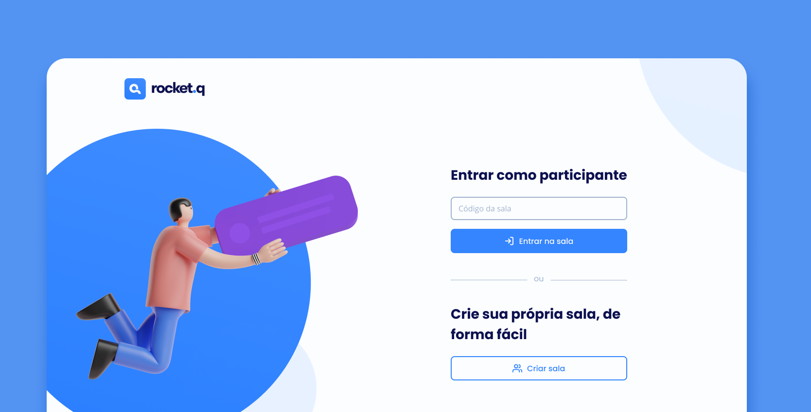
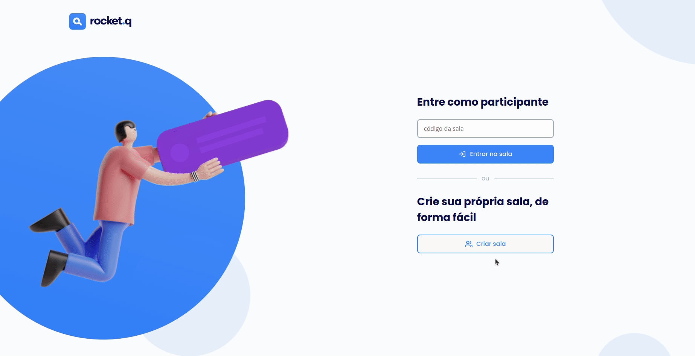

<h1 align="center">
  
</h1>

  <a href="#-tecnologias">Tecnologias</a>&nbsp;&nbsp;&nbsp;|&nbsp;&nbsp;&nbsp;
  <a href="#-projeto">Projeto</a>&nbsp;&nbsp;&nbsp;|&nbsp;&nbsp;&nbsp;
  <a href="#-demonstração">Demonstração</a>

  

## 🚀 Tecnologias

Esse projeto foi desenvolvido com as seguintes tecnologias:

- HTML
- CSS
- JavaScript
- NodeJS
- EJS
- Express
- SQLite

## 💻 Projeto

O Rocket.Q é uma aplicação de interação através de perguntas, sendo possível criar uma sala para internautas anônimos fazerem perguntas e o criador da sala em posse de uma senha gerenciar essas perguntas e marcar como lidas.

## 📷 Demonstração
 
<h1 align="center">
  
</h1>

<h3 align="center">
  Made with  ❤️  by Amanda Araujo
</h3>

